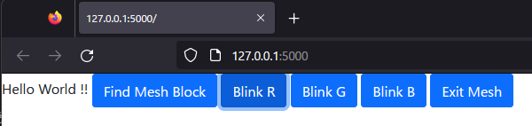

This is a prototype project.

## Run 

```bash
python main.py
```

1. Access to http://127.0.0.1:5000
2. Click "Find Mesh Block" button
3. Power ON Mesh Blocks
4. Waiting..
5. The log will show "found MESH-100LExxxxxx xx:xx:xx:xxx:xx".

## Exit
1. Click "Exit Mesh" button in the browser controlUI
2. Terminate the server app by Ctrl+C

## Browser View


MESH_LE can be lit up from the Browser ControlUI.

This app doesn't work with ASGI server (e.g. Hypercorn)
because of BLE library.